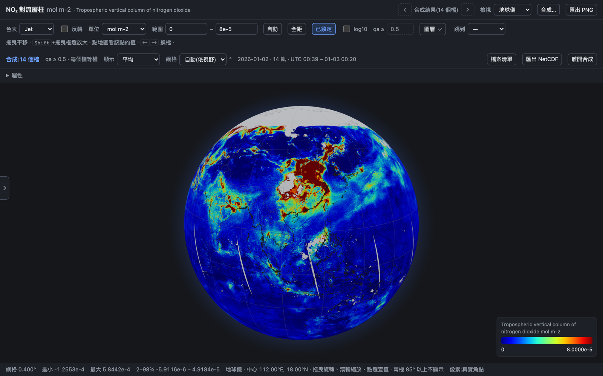

# ncglobe

[](https://www.npmjs.com/package/ncglobe)
[](https://github.com/Alex870521/ncglobe/releases)
[](https://github.com/Alex870521/ncglobe/actions/workflows/test.yml)
[](LICENSE)
[](pyproject.toml)
[](#安裝-install)

A local viewer for NetCDF / HDF files — browse folders, plot any variable, satellite L2 swaths drawn with their real pixel footprints, multi-file composites, and a rotating globe. Runs on your own machine; nothing is uploaded.

在自己電腦上看 NetCDF / HDF 檔的工具,用法類似 Panoply:左邊瀏覽資料夾,右邊看檔案結構、畫任一變數,衛星逐軌(L2)資料用真實像素角點畫,可以把多個檔合成,還能放到會轉的地球儀上。資料不會上傳到任何地方。



## 安裝 Install

**npm(macOS Apple 晶片 / Intel、Windows)** —— 不需要 Python,一個指令裝好:

```bash
npm install -g ncglobe
ncglobe ~/data                 # 打開瀏覽器 http://127.0.0.1:8765,讀 ~/data 底下的檔
```

需要 Node.js 18 以上。npm 只會下載你這台電腦平台的執行檔(約 130 MB)。

**macOS App** —— 到 [Releases](https://github.com/Alex870521/ncglobe/releases) 下載 `ncglobe-macos-arm64.zip`,解壓後拖進「應用程式」。雙擊開啟會先問要看哪個資料夾;Finder 的 `.nc`/`.hdf` 檔也能「打開方式 → ncglobe」。第一次開啟若被擋,按右鍵 →「打開」。

**從原始碼 From source**(Python 3.11+、[uv](https://docs.astral.sh/uv/)):

```bash
git clone https://github.com/Alex870521/ncglobe && cd ncglobe
uv venv && uv pip install -e .
.venv/bin/ncglobe ~/data
```

## 用法 Usage

```bash
ncglobe ~/data                                  # 指定要看的資料夾(可以給好幾個)
ncglobe ~/data /Volumes/MyDrive --port 8800      # 換 port
ncglobe some_file.nc                            # 直接打開這個檔
ncglobe --install-gshhg                         # 下載最細的 GSHHG 海岸線(約 150 MB)
```

伺服器只聽 `127.0.0.1`、只讀啟動時指定(或在 App 裡用「開啟」選)的資料夾。

**使用手冊**:[docs/使用手冊.md](docs/使用手冊.md)(任務導向,附截圖)。

## 功能 Features

- 左側只列 `.nc .nc4 .netcdf .h5 .hdf5 .he5 .cdf .hdf`(HDF4,例如 MODIS)與底下有這些檔的資料夾;年/月分層的資料夾合成一層,搜尋框會連子資料夾一起找。
- 規則網格畫成 heatmap;二維經緯度(Sentinel-5P、GEMS、MODIS L2)用真實像素角點畫,不會有洞;放大到原生解析度。
- 平面地圖與 WebGL 地球儀;圖層:海岸線、國界、經緯線。
- 點選查值、時間序列(可下載 CSV)、播放時間維度、單位換算(mol m⁻² ↔ molec cm⁻² ↔ DU…)。
- 合成:多軌拼接、多日平均、A−B 差值,可匯出 CF NetCDF;匯出 PNG。
- 設定:主題、地圖預設值;有新版時側欄底部會出現「更新」。

## 開發 Development

```bash
uv pip install -e '.[dev]' && .venv/bin/pytest          # 測試
uv pip install -e '.[build]'
.venv/bin/python scripts/build_exe.py --onedir          # 這個平台的執行檔(dist/ncglobe/)
.venv/bin/python scripts/build_exe.py --app             # macOS:dist/ncglobe.app
.venv/bin/python scripts/build_npm.py                   # npm 套件(dist/npm/)
```

發佈:推一個 `v*` 標籤,GitHub Actions(`.github/workflows/release.yml`)會在 macOS(arm64、x64)與 Windows 上建執行檔,發佈到 npm 與 GitHub Releases。

## 授權與資料來源 License & data

ncglobe 以 [MIT](LICENSE) 授權。執行檔內含:

- [Plotly.js](https://github.com/plotly/plotly.js)、[globe.gl](https://github.com/vasturiano/globe.gl)(MIT)
- [Natural Earth](https://www.naturalearthdata.com/) 海岸線、陸地、國界(公有領域)
- [GSHHG](https://www.soest.hawaii.edu/pwessel/gshhg/) 2.3.7 海岸線 l/i/h 三級(LGPL v3,授權文字隨附於執行檔)
