# ncglobe 使用手冊

ncglobe 是在瀏覽器裡看 NetCDF / HDF 檔的工具:左邊點資料夾和檔案,右邊就畫出地圖,可以點地圖查值、看時間序列、轉地球儀,也能把很多個衛星檔合成一張(同一天拼全球、多日平均、兩組相減)。

這份手冊照「要做的事」分節,每節都可以單獨看。截圖用的資料是 S5P TROPOMI NO₂ L2、ERA5、GEMS L2 和 MODIS;換成你自己的檔,操作一樣。

目錄

1. [快速開始](#1-快速開始)
2. [看一個 S5P L2 檔,放大到台灣](#2-看一個-s5p-l2-檔放大到台灣)
3. [點地圖查值、看時間序列](#3-點地圖查值看時間序列)
4. [換檔、換時間、播放](#4-換檔換時間播放)
5. [地球儀](#5-地球儀)
6. [調色階](#6-調色階)
7. [匯出 PNG、分享連結](#7-匯出-png分享連結)
8. [多檔合成](#8-多檔合成)
9. [支援的資料與限制](#9-支援的資料與限制)
10. [快捷鍵](#10-快捷鍵)
11. [常見問題](#11-常見問題)

---

## 1. 快速開始

### 安裝

需要 Python 3.11 以上和 [uv](https://docs.astral.sh/uv/)。在 ncglobe 資料夾裡:

```bash
uv venv && uv pip install -e .
```

### 啟動

```bash
ncglobe ~/data          # 指定要看的資料夾
```

- 瀏覽器會自動打開 `http://127.0.0.1:8765`。沒有自動打開就自己貼這個網址。
- 只看得到啟動時指定的資料夾(可以一次給好幾個:`ncglobe ~/data /Volumes/MyDrive`)。
- 直接給一個檔(`ncglobe 某個檔.nc`)會打開那個檔。
- 結束:在終端機按 `Ctrl+C`。

常用選項:

| 選項 | 用途 |
|---|---|
| `--port 8800` | 換埠號(8765 被占用,或想同時開兩個) |
| `--cache-mb 4000` | 記憶體快取大小(預設 3000 MB)。常來回看同一批大檔就加大 |
| `--no-browser` | 不自動開瀏覽器 |

> 第一次啟動會從網路下載畫圖用的 JavaScript(Plotly、globe.gl),存在 `~/.cache/ncglobe`,之後離線也能用。

### 畫面導覽

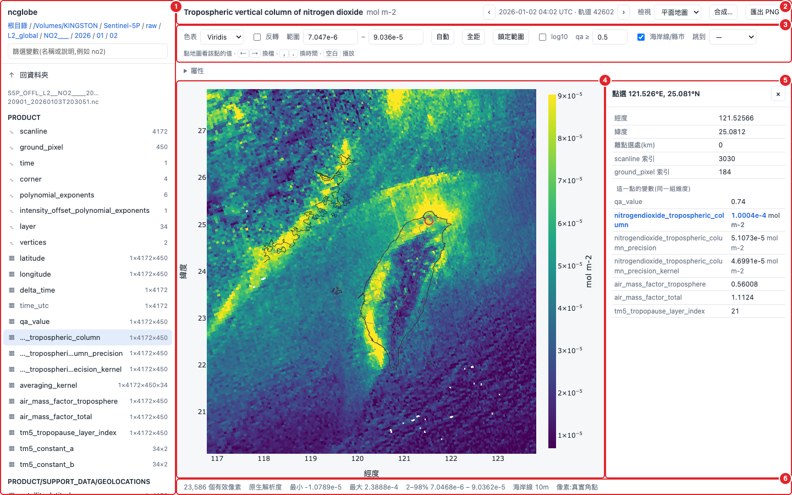

| 編號 | 區域 | 做什麼 |
|---|---|---|
| 1 | 側欄 | 上方是路徑(每一層都能點)、「檔案 / 變數」分頁與篩選框;下方列資料夾、檔案或變數。右邊緣可以拖曳調寬(雙擊還原),工具列的「☰」或 `[` 收起 / 展開 |
| 2 | 第一列工具列 | 變數名稱與單位、換檔(‹ ›)、「檢視」(平面地圖/地球儀)、「合成…」、「匯出 PNG」 |
| 3 | 第二列工具列 | 色階:色表、反轉、範圍、「自動」「全距」「鎖定範圍」、log10、qa 門檻、海岸線、「跳到」 |
| 4 | 地圖 | 拖曳平移、滾輪縮放、按住 Shift 拖曳框選放大、雙擊還原;點一下查值 |
| 5 | 點選面板 | 點地圖後出現:該點的經緯度、所有同維度變數的值、時間序列 |
| 6 | 狀態列 | 有效像素數、是否抽稀、最小/最大值、2–98 百分位 |

---

## 2. 看一個 S5P L2 檔,放大到台灣

打開一個 L2 逐軌檔,幾秒內就會畫出整條軌道;再用「跳到」放大到台灣,看原生解析度的像素。

1. 側欄點資料夾,一層一層進到放檔案的地方(例如 `Sentinel-5P / raw / L2_global / NO2___ / 2026 / 01 / 02`)。

   年/月分層的資料夾會合在一起列:產品資料夾底下直接是 `2026-01`、`2026-02`…,點一下就是那個月的檔;一路只有一個子資料夾的也合成一項(例如 `L2_global/NO2___`、只有一天的 `2026-01-02`)。「..」往上時也會跳過這些被合起來的中間層。

   衛星檔會用**觀測時間(UTC)**當名稱,第二行是軌道號、處理器(OFFL/NRTI/RPRO)和完整檔名;右邊是檔案大小。

   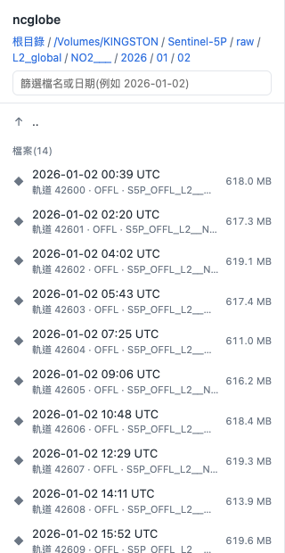

   不想一層一層點:在任何一層的搜尋框打檔名片段或日期(例如 `2026-03-04`、`mcd19a2 2025-06`,空格分開的每個字都要符合),除了這一層,**所有子資料夾**裡符合的檔也會列在「子資料夾中的檔案」,第二行標出它在哪個子資料夾。第一次在某個資料夾搜尋時會在背景逐層掃描,掃到哪裡就先列到哪裡(整顆 4 TB 外接碟約 3 秒);掃完的檔名清單存在 `~/.cache/ncglobe/index/`,之後同一個資料夾馬上就有結果,清單超過 10 分鐘會在背景自動更新。

2. 點一個檔(例如 `2026-01-02 04:02 UTC`)。ncglobe 會自己挑主要變數畫出來(S5P NO₂ 是 `nitrogendioxide_tropospheric_column`),側欄改列這個檔的所有變數。

   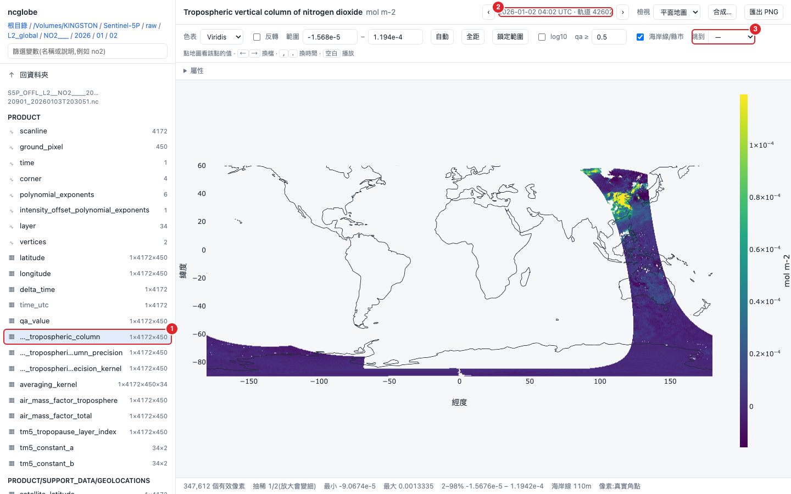

   - ①側欄反白的是目前畫的變數。名稱太長時,共同的開頭會省略成 `…_tropospheric_column`,滑鼠停在上面可以看全名、說明、單位和維度。
   - ②工具列顯示這個檔的觀測時間與軌道號。
   - ③「跳到」可以直接跳到「資料範圍」「全球」「東亞」「台灣」。

3. 要畫別的變數,在側欄點它;變數很多時在上方篩選框打字(例如 `precision`)。灰色、點不下去的是不能畫的變數(例如文字)。

   - 變數清單最上面的「常用」(★):這種產品最常看的幾個變數,附中文名稱(例如 S5P 的 NO₂ 對流層柱、GEMS 的 O₃ 總柱、MODIS 的 AOD 550 nm、ERA5 的 2 m 氣溫),開檔時預設畫的就是第一個。下面「全部變數」照舊依群組列出。
   - 側欄上方的「檔案」「變數」分頁:「檔案」列這個檔所在資料夾的檔,「變數」列這個檔的變數。在側欄逛到別的資料夾後,按「變數」(或點工具列上的檔名)就回到正在畫的檔,不會重新讀檔,地圖也不會變。
   - 變數依群組列出,點群組名稱收合 / 展開(會記住)。預設只展開主要的群組(S5P 是 `PRODUCT`);每組裡二維的變數排前面。
   - 根目錄會列「最近開啟」:最近 10 個檔與當時看的變數,點一下直接回去。

4. 「跳到」選「台灣」。看狀態列(①):從「抽稀 1/2(放大會變細)」變成「原生解析度」,海岸線也換成更細的一級。

   工具列的「圖層」選單可以分別開關**海岸線、國界(虛線)、經緯線**,選擇會記住;平面地圖、地球儀、匯出圖都照這個畫。

   海岸線依畫面大小自動換級。裝了 GSHHG(`ncglobe --install-gshhg`,約 150 MB)時:全球約 5 km、東亞約 1 km、台灣約 200 m、放大到城市約 40 m;沒裝時用 Natural Earth(最細 1:1,000 萬,約 1–2 km)。狀態列會寫目前用哪一級。

   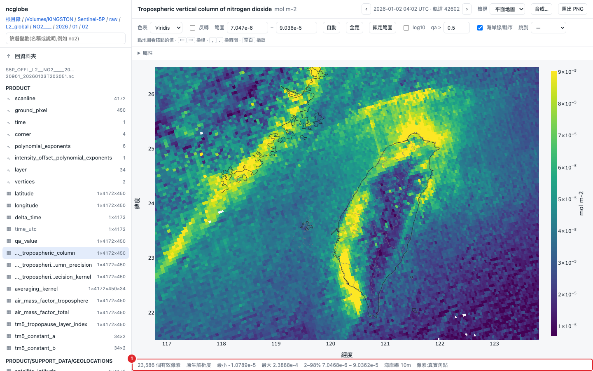

   也可以自己操作:**拖曳**移動地圖、**滾輪**縮放、**按住 Shift 拖曳**拉一個框放大。**雙擊**地圖回到整個資料範圍。縮放、平移時色階範圍不會跟著變(每放一下就重算會卡);想依目前畫面重算,按工具列的「自動」。

> 每一格都是一個真實的衛星像素(用檔案裡的四個角點畫),不是內插。白色的地方是沒有值,或 qa_value 低於門檻被篩掉(見 [qa 是什麼](#qa-是什麼要設多少))。

實測(Mac + 外接 SSD,伺服器剛重啟):620 MB 的 S5P NO₂ L2 檔從開網址到出圖約 2–3 秒;放大到台灣約 1 秒。

### 找出經過台灣的那一軌

一天 14 軌只有 1–2 軌經過台灣。不用一個一個打開:

1. 先打開任一軌,「跳到」台灣(或放大到你要的區域)。
2. 側欄點「回資料夾」。檔案清單標題會多出「● = 在目前地圖範圍內有資料」,每個檔左邊的符號變成:
   - **●(藍色)**:這個檔在目前地圖範圍內有資料;
   - **○**:沒有。

   地圖上畫的仍然只有目前打開的那一個檔;● 是告訴你「打開這個檔,畫面範圍內會有東西」。畫面跨度超過 60°(例如整軌從南極到北極)時不標 —— 範圍那麼大,相鄰好幾軌都會碰到,標了沒有意義;放大到一個區域就會出現。

   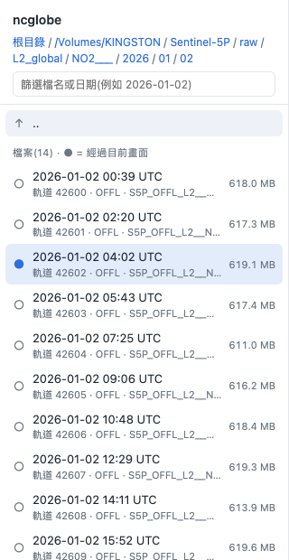

3. 點有 ● 的檔。14 個 600 MB 的檔判斷完約幾秒。

---

## 3. 點地圖查值、看時間序列

在地圖上點一下,右邊會出現點選面板,列出這一點的值;如果變數有時間維度,還會畫出這一點整段時間的序列。

### L2 衛星檔

1. 在地圖上點一下要查的位置。地圖上會出現紅色圓圈標出點選處。面板打開後地圖會變窄,圓圈會跟著移動,以圓圈為準。

   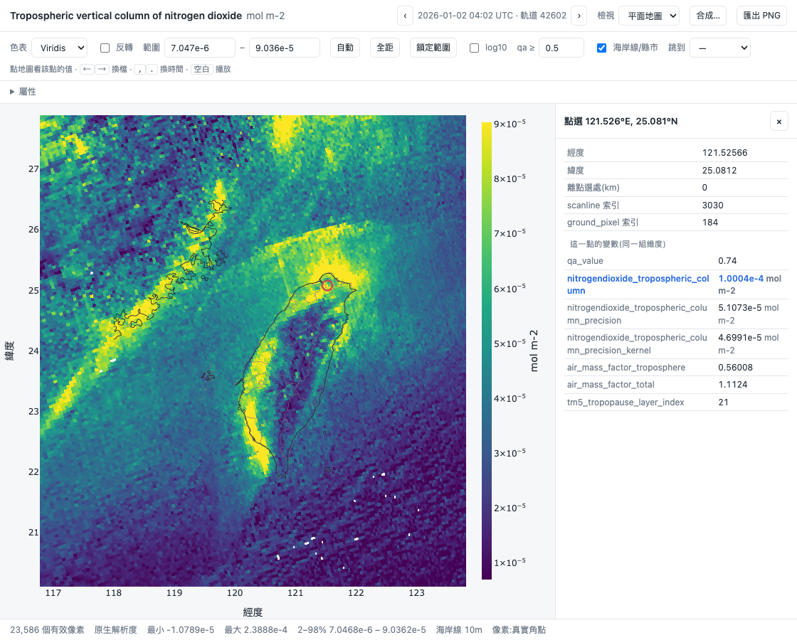
2. 右邊的點選面板:

   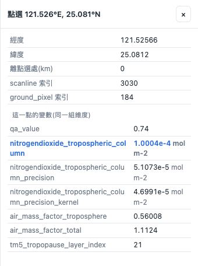

   - 上半部:點選處最近的像素的經緯度、離點選處多遠(km)、它在檔案裡的索引(scanline、ground_pixel)。
   - 下半部:**同一個像素**所有變數的值。藍色粗體的是地圖上正在畫的變數。可以直接對照 precision、air mass factor、qa_value。
3. 換檔、換時間、改 qa 門檻時,面板會自動重查同一點。
4. 關閉:按面板右上角「×」或 `Esc`。

點在軌道外面,面板會說最近的像素在幾 km 外;點到被 qa 篩掉的像素,面板會寫「這個像素 qa_value = … 地圖上已被篩掉;下面是它的原始值」。

### 跨檔時序(一天一個檔的衛星資料)

S5P 這類資料一天一個(或幾個)檔,單一檔裡沒有時間軸。點選面板下方的「跨檔時序」會把同一點在每個檔的值畫成時序:

1. 在地圖上點要看的位置。
2. 選「單點」(最近的像素)或「半徑 10 / 25 / 50 km」(範圍內有效像素的平均,誤差棒是標準差)。
3. 按「畫出」。來源是**這個資料夾的所有檔**;在合成畫面裡則是**合成用的那些檔**(相減時是 A 那一組)。
4. 紅點是目前打開的檔。「下載 CSV」存下時間(UTC)、值(目前選的單位)、像素數、標準差與檔名。

實測:台北半徑 25 km、2026 年 7 月 O₃ 共 40 個檔,約 4 秒,33 個檔有值(其餘是軌道沒經過或被 qa 篩掉)。qa 門檻、時間維度位置、單位都用目前的設定;換資料夾要先切到那個資料夾的檔。

### 有時間維度的檔(ERA5)

1. 打開 ERA5 檔(例如 `era5_sfc_d2m_t2m_20250101_20251231.nc`),點變數 `t2m`。
2. 點地圖上一格。面板裡會出現這一格**整段時間**的序列圖(②),紅色直線是地圖上目前顯示的時間。

   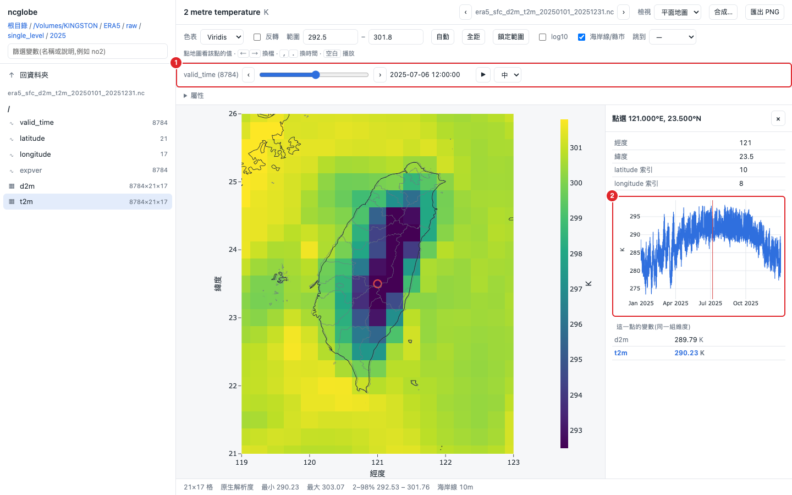

3. 序列圖可以用滑鼠框選放大、雙擊還原。

---

## 設定與更新

側欄最下面:頭像與名字(點一下改名字、頭像顏色)、⚙ 設定。設定存在 `~/.config/ncglobe/settings.json`,App 與瀏覽器共用。

- **外觀**:主題跟系統、淺色或深色。
- **地圖預設值**:色表、qa 門檻、播放速度(圖層在工具列「圖層」選單) —— 開新檔時套用;網址或畫面上改過的優先。
- **匯出 PNG 標記**:勾選後圖的右下角小字標上 ncglobe。
- **更新**:填 GitHub 專案(例如 `帳號/ncglobe`)後,每 6 小時檢查一次 Release;有新版時側欄底部出現「更新 x.y.z」,點了打開下載頁。留空就不檢查、不連網路。
- **資料**:清除搜尋用的檔名清單、清除最近開啟清單;**關於**列出目前可讀的資料夾與設定檔位置。

## 4. 換檔、換時間、播放

不用回側欄,就能在同一個資料夾的檔案之間切換,或在時間維度上前後移動;變數、視野、色階設定都會保留。

### 換檔

- 第一列工具列的「‹」「›」,或鍵盤 `←` `→`。
- 換的是**同一個資料夾**、側欄上的順序(依檔名排序,S5P 就是依時間)。
- 換檔後沿用:同一個變數、目前的視野(例如台灣)、時間維度的位置、鎖定的色階範圍。
- 從側欄點開另一個檔時,如果沿用的視野裡沒有它的資料(例如看著台灣、點開經過歐洲的那軌),會自動跳到那個檔的資料範圍。
- 用 `←` `→` 換到的檔在目前視野裡沒有資料(例如下一軌沒經過台灣),畫面中間會寫「這個檔在目前的範圍內沒有有效資料(軌道沒經過,或全被 qa 篩掉)」,視野不會自己跳走,方便繼續按 `→` 往下找;要看那一軌的位置,按「跳到資料範圍」。

### 換時間(或其他維度)

有時間、高度層等額外維度的變數,工具列下方會多一列維度列(上圖 ①):

- 拖曳滑桿,或按「‹」「›」,或鍵盤 `,` `.`。右邊會顯示目前的時間。
- 「▶」播放,再按一次(變成「■」)停止;旁邊的選單選「慢/中/快」。鍵盤 `空白鍵` 也能播放/停止。
- 播放時色階範圍固定在開始播放那一刻的範圍(每格各自自動的話,同一個顏色在不同時間代表不同數值)。規則經緯網格的檔(例如整年合併檔)播放時只換資料那一層,座標軸、海岸線、色階條不會跟著閃。
- 好幾個維度時,鍵盤只控制第一個。

---

## 5. 地球儀

把資料貼在會轉的地球上,看大範圍的分布(例如一整軌、東亞)。

1. 第一列工具列「檢視」選「地球儀」。地球儀會從平面地圖目前的視野開始。
2. 操作:
   - **拖曳**旋轉,**滾輪**縮放。放大後會換更細的圖,一樣清楚。
   - 滑鼠停在地球上會顯示該點的經緯度與數值;**點一下**打開點選面板。
   - 「跳到」選單在地球儀上也能用(轉到台灣、東亞…)。
3. 回平面:「檢視」選「平面地圖」。

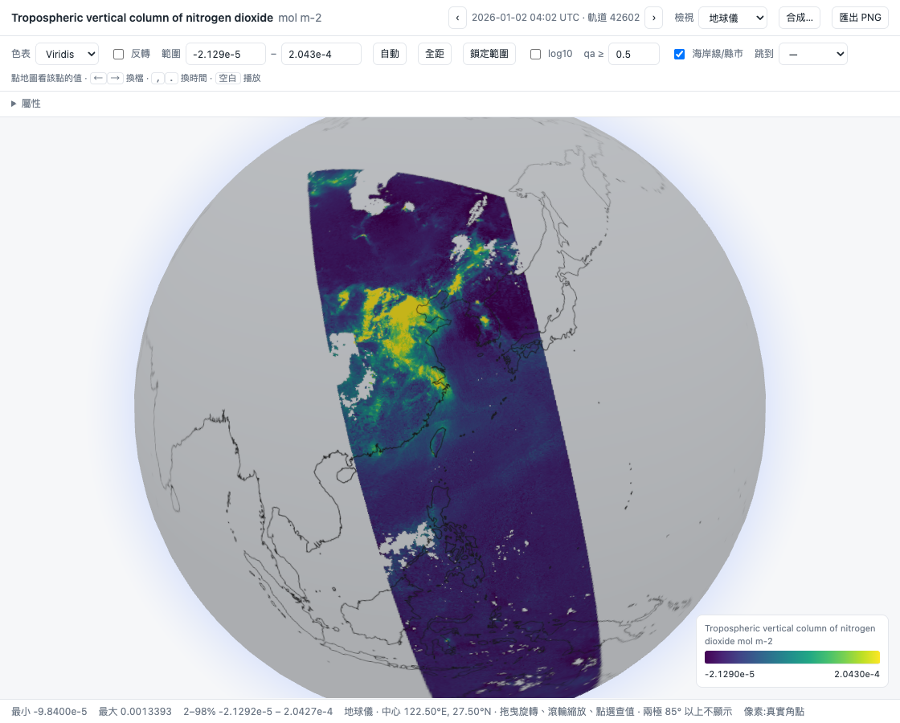

- 還沒載入的區域是灰色,幾秒內會補上。
- 緯度 85° 以上(兩極)不顯示。
- 色階條在右下角;色表、範圍、qa 的設定跟平面地圖一樣有效。

---

## 6. 調色階

所有色階控制都在第二列工具列。


| 編號 | 控制 | 說明 |
|---|---|---|
| 1 | 色表 | 預設 Jet;另有 Viridis、Turbo、Plasma、Inferno、RdBu、YlOrRd、Greys |
| 2 | 反轉 | 顏色順序倒過來 |
| 2b | 單位 | 換顯示單位(只在有換算時出現):mol m⁻² ↔ molec cm⁻² ↔ µmol m⁻²,臭氧另有 DU;K ↔ °C;Pa ↔ hPa。地圖、色階範圍、點選值、時序、匯出圖都跟著換,資料本身不變;每種原始單位記住你上次選的 |
| 3 | 範圍 | 色階的下限、上限。直接打數字(可以用 `1e-4` 這種寫法),按 Enter |
| 4 | 自動 | 用**目前畫面內**資料的 2–98 百分位(打開檔案時的預設) |
| 5 | 全距 | 用目前畫面內資料的最小–最大值 |
| 6 | 鎖定範圍 | 鎖住範圍:換檔、換時間都不重算(縮放、平移本來就不重算)。按下後變成「已鎖定」 |
| 7 | log10 | 用對數色階。範圍框裡的數字會變成 log10 值 |
| 8 | qa ≥ | 只畫 qa_value 大於等於這個值的像素(只有 S5P 這類有 `qa_value` 的檔才會出現) |

常見用法:

- **比較不同天、不同軌**:先把範圍設好(例如 `0` – `1e-4`),換檔時顏色才有可比性。**在範圍框打數字會自動鎖定**(按鈕變「已鎖定」);要恢復自動就按「自動」或「全距」。

  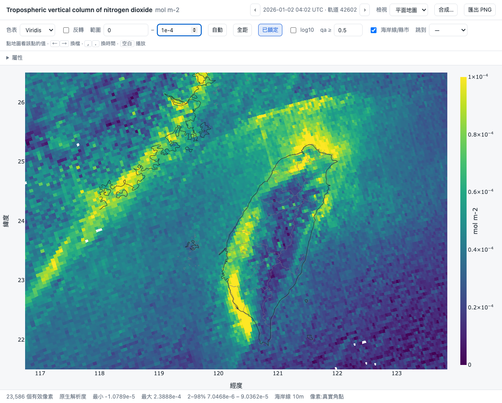

- **放大後顏色變了**:沒鎖定時,每次縮放都會用新畫面的資料重算 2–98 百分位。要固定就按「鎖定範圍」。
- **有負值的柱濃度**:S5P 對流層 NO₂ 本來就有負值(雜訊),log10 會把 ≤ 0 的像素變成空白。
- **差值圖**(相減結果):會自動換成 RdBu,範圍以 0 為中心。

---

## 7. 匯出 PNG、分享連結

### 匯出 PNG

按第一列工具列的「匯出 PNG」。下載的是**伺服器重畫**的高解析圖(200 dpi,高 1700 像素,寬度依區域形狀調整,例如台灣是直的、東亞是橫的),含標題、觀測時間與檔名的副標題、色階條、海岸線,範圍就是目前畫面上的範圍、色表和色階。資料超出色階範圍時,色階條兩端會畫成箭頭。

- 地圖類變數:檔名是 `變數名.png`;有時間維度時會加上時間,例如 ERA5 `t2m` 在 2025-07-06 12:00 匯出成 `t2m_20250706120000.png`。
- 副標題是觀測時間、軌道與檔名(合成時是日期摘要、qa 門檻與平均方式)。實測放大到台灣的 L2 圖,按下後 1 秒內開始下載。
- 非地圖變數(一維曲線、非經緯度的二維陣列):匯出的是畫面上的圖本身。
- 在地球儀上匯出:
  - 看整顆地球時,匯出正射投影的地球圖。
  - 放大到某個區域後(用滾輪,或「跳到」台灣、東亞)匯出,得到的是該區域的平面地圖(以畫面中心為準)。

### 分享連結

網址列會一直記住目前的狀態:檔案、變數、視野、時間位置、色表、範圍、log、qa、檢視方式、合成。

- 複製網址給同一台電腦上的人、或存到筆記裡,之後貼上就回到同一個畫面。
- 對方的 ncglobe 必須讀得到**同一個路徑**的檔(網址裡寫的是檔案的完整路徑)。
- 伺服器只聽本機(127.0.0.1),別台電腦打不開你的網址。
- 合成結果的連結只在**伺服器沒重啟、而且是最近 3 次合成之一**時有效;過期了會顯示單一檔並說明。

---

## 8. 多檔合成

把很多個檔合成一張圖。三種用法:

| 想做的事 | 選法 |
|---|---|
| 同一天的 14 軌拼成全球 | 「合成」+ 勾同一天的檔 + 範圍「全部(不裁切)」 |
| 一段期間的平均(例如一週、一個月) | 「合成」+ 觀測日期篩選 + 平均方式選「每天等權」 |
| 某一天跟平常差多少 | 「相減」:目前的檔 − 所選檔的平均 |

合成是把每個檔的像素分配到規則網格(例如 0.05°)再平均。L2 像素用真實的四個角點分配,不是只看中心點。

### 8.1 同一天 14 軌拼全球

1. 打開那天任一軌(例如 `L2_global/NO2___/2026/01/02` 裡的檔),畫你要的變數。
2. 按「合成…」,會跳出合成視窗。

   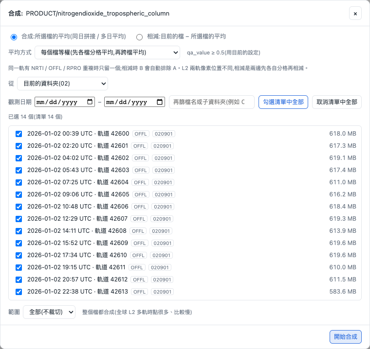

3. 上方選「合成:所選檔的平均(同日拼接 / 多日平均)」。
4. 按「勾選清單中全部」。右邊會顯示「已選 14 個(清單 14 個)」。
5. 下方「範圍」選「全部(不裁切)」。選「目前視野」只合成畫面上看到的範圍,比較快。
6. 按「開始合成」。進度條會顯示做到第幾個檔、累積多少有效像素、經過幾秒;中途可以按「取消合成」。

   實測:14 軌全球(共 8.1 GB、約 1,950 萬個有效像素)伺服器計算 2.9 秒(這些檔之前已經打開過,解壓好的資料在記憶體裡);伺服器剛啟動、沒開過這些檔時約 6 秒,多花的時間在讀檔解壓。

7. 完成後視窗關閉,地圖換成合成結果,工具列下方多一列合成列:

   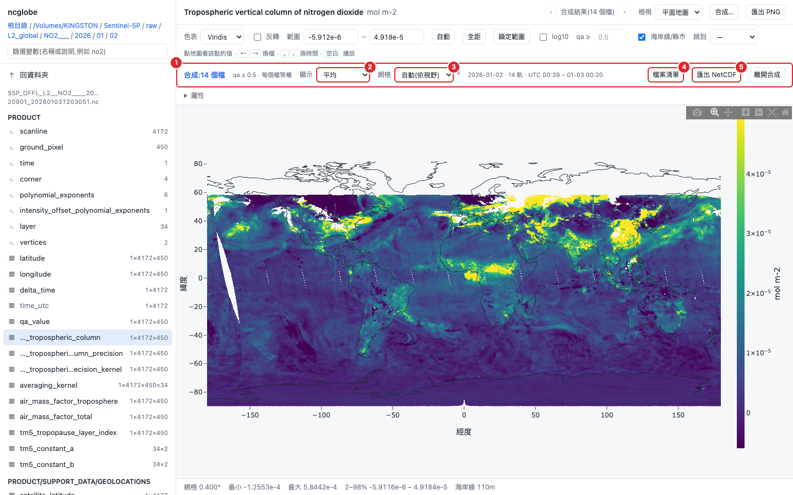

   - ① 合成列:「合成:14 個檔」、所用的 qa 與平均方式、日期摘要。
   - ② 「顯示」:平均 / 覆蓋檔數 / 檔間標準差。
   - ③ 「網格」:預設「自動(依視野)」,放大會自動變細;也可以固定 0.02°–1°。
   - ④ 「檔案清單」:實際用了哪些檔。
   - ⑤ 「匯出 NetCDF」。

8. 按「離開合成」回到原本的單一檔。

### 8.2 多日平均(例如台灣一週)

1. 打開其中一天的檔,先**放大到要的區域**(例如「跳到」台灣)。範圍越小越快。
2. 按「合成…」。
3. 「從」選單選要從哪個資料夾挑檔:
   - 「目前的資料夾」:只列這個資料夾的檔。
   - 往上一層「…(含所有子資料夾)」:跨月份時用(資料按 年/月 分資料夾時,選年那一層就能挑整年)。
4. 「觀測日期」填起訖(例如 2026-01-01 – 2026-01-10)。篩的是檔名裡的**觀測日期**,不是處理日期。
5. 「平均方式」選一種(差別見下一節)。多日平均建議「每天等權」。
6. 「勾選清單中全部」→ 範圍保持「目前視野」→「開始合成」。至少要選 2 個檔。

   實測:2026-01-01 – 01-10 共 14 軌(10 天,有幾天有 2 軌經過)、台灣範圍,第一次 8.1 秒,再做一次 2.6 秒。

   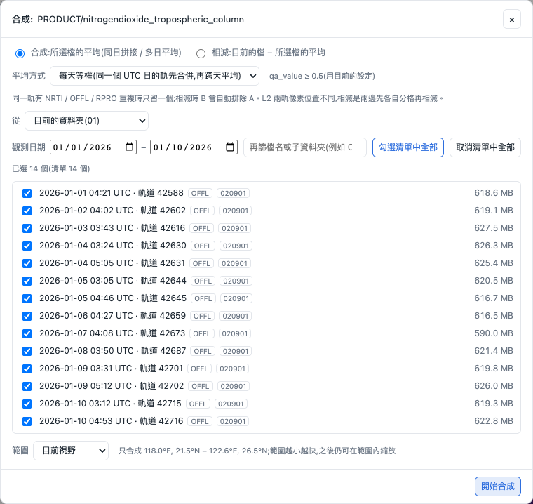

   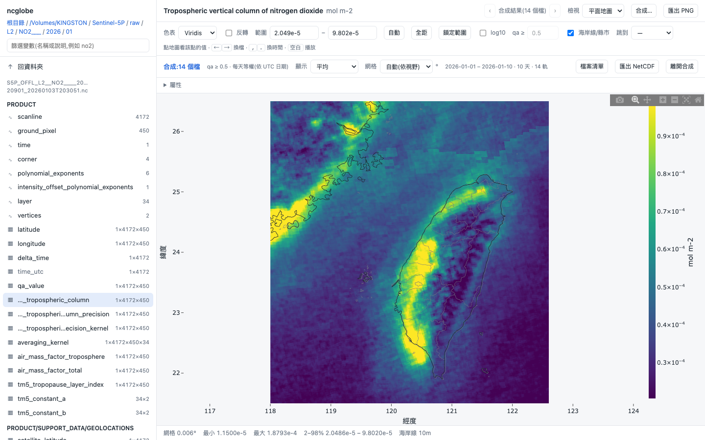

7. 「顯示」改成「覆蓋天數」,看每一格有幾天有資料;天數少的格子平均值不穩。覆蓋數模式的色階預設用最小–最大(全距),色階條不標單位。

   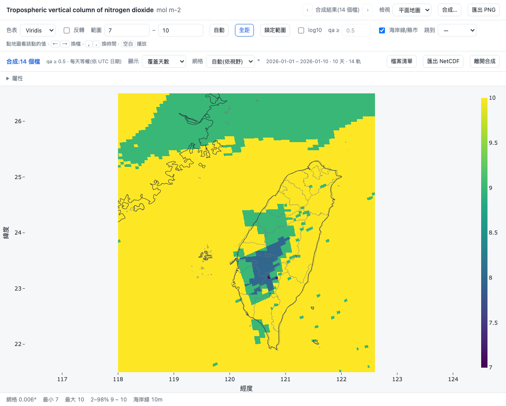

> 換篩選條件時,之前勾的檔**不會**被取消。若有勾了但不在目前清單裡的檔,會出現紅字「已選 N 個,其中 M 個不在目前清單裡」,按「只保留清單中的」清掉。

### 8.3 平均方式:三種差在哪

假設一格在 1/1 被 2 軌各看到 1 次(值 2、4),1/2 被 1 軌看到 3 個像素(值 10、10、10):

| 平均方式 | 怎麼算 | 這一格 | 什麼時候用 |
|---|---|---|---|
| 每個檔等權 | 每個檔先在格子裡平均,再對檔平均 | (2 + 4 + 10) / 3 = 5.3 | 同一天拼接(每格通常只有 1–2 軌) |
| 每天等權 | 同一天(**UTC 日期**)的檔先合在一起,再對天平均 | ((2+4)/2 + 10) / 2 = 6.5 | **多日平均**:高緯度一天被好幾軌重疊,不會因此權重比較大 |
| 每個像素等權 | 所有觀測直接平均 | (2 + 4 + 10×3) / 5 = 7.2 | 想要「所有有效觀測的平均」;觀測多的天權重大 |

- 「覆蓋數」「標準差」跟著平均方式:每個檔等權顯示「覆蓋檔數」「檔間標準差」,每天等權顯示「覆蓋天數」「天間標準差」;像素等權只有平均。
- 標準差至少要 2 組才算得出來;每格都只有 1 組時會顯示說明。
- 「天」是 UTC 日期。GEMS 23:45 UTC 的掃描是台灣隔天早上 07:45,會算在前一天。

### 8.4 相減 A − B

看某一天(A)和一段期間平均(B)的差。

1. 打開要當 A 的檔(例如 1/2 經過台灣的那軌),放大到台灣。
2. 「合成…」→ 上方選「相減:目前的檔 − 所選檔的平均」。
3. 勾 B 的檔(例如觀測日期 2026-01-03 – 2026-01-10 全部)。B 裡如果也勾到 A,會自動排除。
4. 「開始合成」。結果自動用 RdBu、以 0 為中心;紅色是 A 比 B 高。

   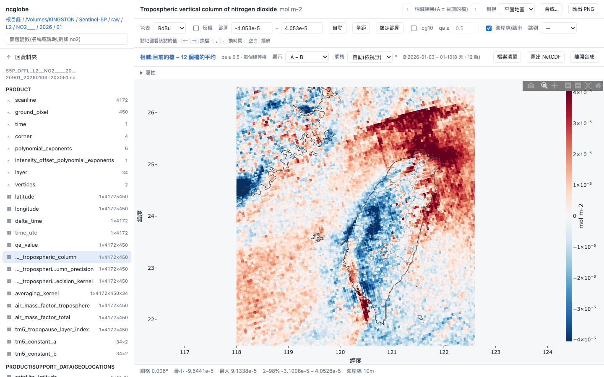

5. 「顯示」可以切換 A − B、A(目前的檔)、B(平均)、B 覆蓋數。

L2 兩軌的像素位置不同,所以是兩邊先各自分到同一個網格再相減。

### 8.5 檔案清單與提醒

合成列上的「檔案清單」會展開這次**實際用到**的每個檔:時間(UTC)、軌道/模式、檔名。

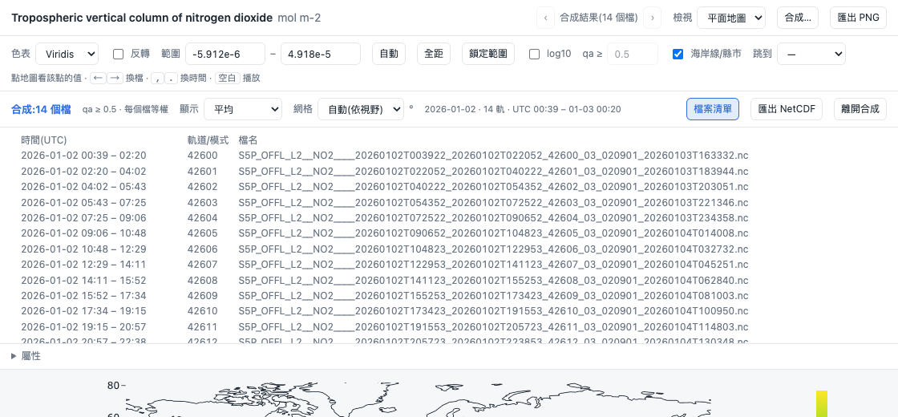

清單下方和合成列上可能出現的提醒:

| 提醒 | 意思 |
|---|---|
| 另有 N 個檔在範圍內沒有有效資料 | 軌道沒經過這個範圍,或全被 qa 篩掉。不算錯誤 |
| 同一軌有重複的檔…每軌只留 RPRO > OFFL > NRTI 中最新的一個 | 同一軌勾了 NRTI 和 OFFL 等,只用一個 |
| 混用了不同演算法版本 | 例如 020600 和 020901 混在一起,數值可能有系統差 |
| 混用了 GEMS 不同掃描模式 | FC、FW 等範圍不同 |
| N 個檔讀取失敗 | 檔案壞掉或變數不存在,清單裡會列原因 |

### 8.6 匯出 NetCDF

按合成列的「匯出 NetCDF」,下載**目前視野、目前網格**的結果(`變數名_composite.nc`),裡面有:

- 一般合成:平均、覆蓋數、標準差。
- 相減:A、B、A − B。
- 經緯度座標 `latitude`、`longitude`;檔案遵循 CF-1.8。
- 全域屬性記錄所用的檔案清單(`files`)、qa 門檻(`qa_min`)、平均方式(`weighting`)、格距(`grid_resolution_deg`)、觀測起訖(`time_coverage_start/end`)。

**先在「網格」選好格距再匯出。**「自動(依視野)」會依畫面放大程度決定格距:實測在台灣範圍是 0.0056°(900×829 格),比 TROPOMI 像素(約 0.03–0.05°)細很多,檔案大、相鄰格子其實是同一個像素。做後續分析通常選 0.05° 或 0.1°。

### 8.7 合成要知道的事

- 合成用的 qa 門檻是**按「開始合成」當下**的值;之後 qa 框會鎖住,要換門檻得重新合成。
- 伺服器只保留**最近 3 個**合成結果;伺服器重啟也會清掉。
- 所有檔的有效像素加起來上限 6000 萬點;超過會停在那個檔並提示縮小範圍或少選檔。
- 規則網格的檔(ERA5、L3)每個檔最多 500 萬格,太大請先放大。

---

## 9. 支援的資料與限制

### 看得到哪些檔

側欄只列這些副檔名,以及底下有這些檔的資料夾:`.nc .nc4 .netcdf .cdf .h5 .hdf5 .he5 .hdf`。

| 資料 | 怎麼畫 | 備註 |
|---|---|---|
| S5P TROPOMI L2(NO₂ 等) | 逐像素,用角點畫 | 有 qa 篩選;依軌道號辨識、合成時自動去重 |
| S5P L3(規則網格) | heatmap | |
| GEMS L2 | 逐像素 | 依檔名辨識掃描時間與模式(FC/FW/HK…) |
| MODIS L2(.hdf,例如 MOD04_L2、MYD04_L2) | 逐像素 | 依檔名辨識觀測時間;一粒約 5 分鐘、1,300 km 寬 |
| MODIS 正弦投影格點(.hdf,例如 MCD19A2 MAIAC) | 逐格 | 由 HDF-EOS 的網格資訊算出經緯度(1 km、5 km 網格各一組);依檔名辨識日期與格點(h28v06…),多塊格點可合成;`Orbits` 維度是同一天的第幾次過境,合成用目前選的那一次 |
| ERA5 等規則經緯度網格 | heatmap | 有時間維度就有滑桿與時間序列 |
| 沒有經緯度的變數 | 一維畫曲線、二維畫成陣列熱圖 | 不能合成、不能用地球儀 |

### 目前的限制

- **MODIS 也沒有品質旗標篩選**:MOD04 的 `Land_Ocean_Quality_Flag`、MCD19A2 的 `AOD_QA` 目前不會套用;MOD04 的 AOD 變數本身已依檔案說明篩過品質(見變數說明)。
- **GEMS 沒有品質旗標篩選**:qa 篩選只認 `qa_value` 變數(S5P)。GEMS 的 `FinalAlgorithmFlags` 等旗標目前不會套用,合成時也不會;合成視窗會寫「這個變數沒有 qa_value,不做品質篩選」。
  下圖是 GEMS 2026-06-01 03:45 UTC 的 `ColumnAmountNO2Trop`,沒有篩選時看得到成排的異常像素;判讀前請自己對照旗標變數(點選面板會列出同一像素的 `FinalAlgorithmFlags` 等值)。

  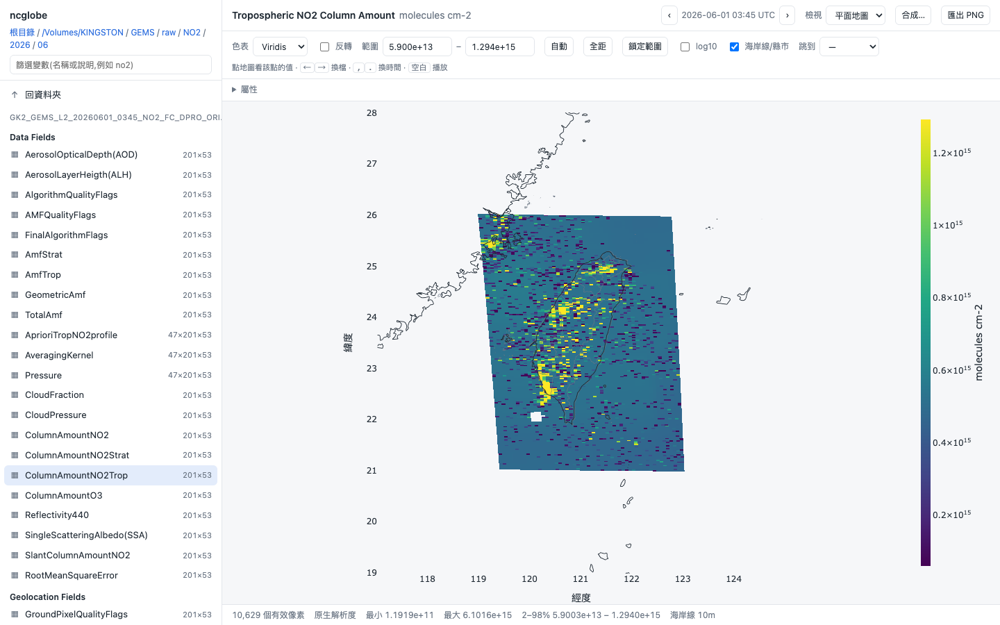

- MODIS L2 `.hdf`(例如 `MYD04_L2`)可以直接打開,預設畫 `Optical_Depth_Land_And_Ocean`:

  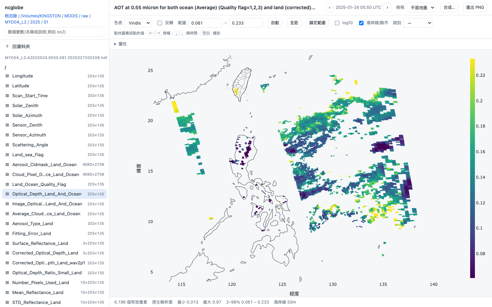

- **投影只有兩種**:平面地圖(經緯度)和地球儀。
- **合成**:只保留最近 3 個,伺服器重啟會清掉(連結隨之失效)。
- 伺服器只聽本機,不能讓別台電腦連進來。
- 只能讀,不會改你的檔。

---

## 10. 快捷鍵

焦點在輸入框、選單裡時,快捷鍵不作用(先點一下地圖)。

| 按鍵 | 作用 |
|---|---|
| `←` `→` | 上一個 / 下一個檔(同資料夾) |
| `,` `.` | 上一個 / 下一個時間(第一個額外維度) |
| `空白鍵` | 播放 / 停止 |
| `/` | 跳到側欄的篩選框 |
| 滑鼠側鍵「上一頁」/ App 的 `⌘[` | 側欄回上一層:變數 → 這個檔的資料夾 → 上一層資料夾 |
| 滑鼠側鍵「下一頁」/ App 的 `⌘]` | 回到剛剛離開的那一層 |
| `[` | 收起 / 展開側欄 |
| `Esc` | 關閉點選面板;合成視窗開著時關閉視窗 |
| 滾輪 | 縮放(平面地圖、地球儀) |
| 拖曳 | 平面地圖:平移;地球儀:旋轉 |
| `Shift` + 拖曳 | 平面地圖:框選放大 |
| 雙擊 | 平面地圖回到資料範圍 |

---

## 11. 常見問題

### 為什麼一片空白?

- **畫面中間有「這個檔在目前的範圍內沒有有效資料」**:這一軌沒經過目前的視野(例如你在看台灣,但換到的是經過歐洲的那軌),或全被 qa 篩掉。按旁邊的「跳到資料範圍」。
- **整張地圖只有零星幾點**:qa 門檻太高。把「qa ≥」改低(例如 0)試試。
- **顏色全部一樣**:範圍被鎖住了,而新的檔數值差很多。按「自動」。
- **地球儀一開始是灰色**:圖還在畫,等幾秒。
- **出現紅字錯誤**:看下一題。

### 為什麼第一次很慢?

S5P L2 這類檔是壓縮存放的,第一次讀某個變數要把整塊解壓。之後伺服器會把解壓好的陣列留在記憶體(預設 3 GB,用 `--cache-mb` 調),同一個檔再開、放大、換時間都很快。

- 右上角會顯示「讀取中… N 秒」,旁邊有「取消」。
- 單一請求 90 秒(匯出圖 180 秒)沒有回應會停下來並說明;**再按一次通常就好**,因為伺服器多半已經讀完。
- 外接硬碟比內建 SSD 慢;機械硬碟會更慢。

### qa 是什麼?要設多少?

`qa_value` 是 S5P 每個像素的品質指標,0–1,越高越可靠(雲少、反演成功)。ncglobe 預設只畫 qa ≥ 0.5 的像素。

- 門檻怎麼選請依你用的產品的官方說明(S5P 各產品的 Product Readme File)。例如對流層 NO₂ 一般建議 0.75。
- 實測(2026-01-02 經過台灣那軌、台灣範圍):qa ≥ 0 有 23,616 個像素,≥ 0.5 有 23,586 個,≥ 0.75 只剩 5,593 個。門檻提高,地圖上的空白會明顯變多。
- 改 qa 會立刻重畫;點選面板會告訴你點到的像素 qa 是多少、是否被篩掉。
- 沒有 `qa_value` 的檔(GEMS、MODIS、ERA5)不會出現 qa 框。

### 畫面上的顏色怎麼跟數值對照?

- **最準**:點一下,看點選面板。那是檔案裡的原始值,不是從顏色反推。
- 平面地圖上滑鼠停著會顯示附近取樣點的經緯度與值;地球儀上停著會顯示該點的值。
- 狀態列是**目前畫面內**的統計:最小、最大、2–98 百分位。
- 狀態列寫「抽稀 1/N」時,畫面上是每 N 個取 1 個的預覽,放大到夠小就會變成「原生解析度」。點選面板永遠讀原始資料。
- 單位寫在標題後面與色階條旁。S5P 的柱濃度單位是 mol m⁻²;要用 molec cm⁻² 或 DU 看,在色階工具列的「單位」換(1 mol m⁻² = 6.022×10¹⁹ molec cm⁻²;1 DU = 4.4615×10⁻⁴ mol m⁻²)。

### 網址太長、我想重新開始

按側欄最上方的「根目錄」,或把網址 `#` 後面的部分刪掉再按 Enter。

---

截圖由 `scripts/doc_screenshots.py` 產生;介面改了以後執行 `.venv/bin/python scripts/doc_screenshots.py` 重拍。
